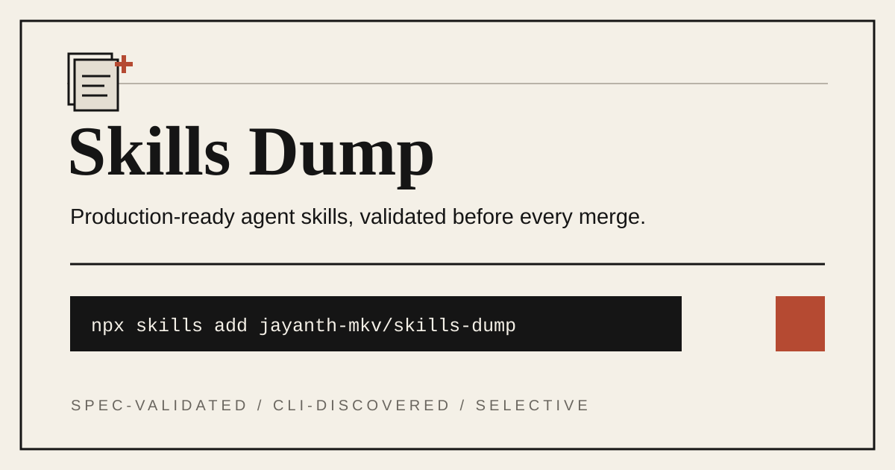
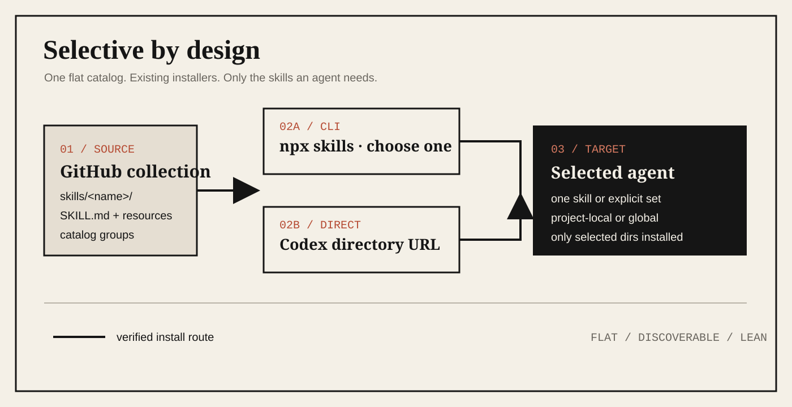

<div align="center">
  
  <h1>Agent Skills Registry</h1>
  <p><strong>A quality-gated catalog of installable agent capabilities.</strong></p>
  <p>Focused workflows. Selective installation. Repeatable validation.</p>
  <p>
    <a href="LICENSE"></a>
    <a href="https://agentskills.io"></a>
    <a href="https://skills.sh/jayanth-mkv/agent-skills-registry"></a>
    <a href="https://github.com/jayanth-mkv/agent-skills-registry/actions/workflows/validate.yml"></a>
  </p>
  <p>
    <a href="#skills">Skills</a> ·
    <a href="#install">Install</a> ·
    <a href="#reliability-gates">Reliability</a> ·
    <a href="#architecture">Architecture</a> ·
    <a href="#contributing">Contributing</a> ·
    <a href="#trust-model">Trust</a>
  </p>
</div>

<p align="center">
  
</p>

## What is Agent Skills Registry?

Agent Skills Registry is a reliability-first, open-source catalog of focused agent capabilities intended for real project work. Each skill packages concise instructions, optional references, deterministic scripts, and reusable assets in the portable Agent Skills format.

Every merged skill must pass repository invariants, the official specification validator, real `skills` CLI discovery, catalog synchronization, and its relevant behavioral checks. Skills remain independently installable, so teams can add the capability they need without loading an unrelated bundle.

The catalog is designed to grow through focused, independently installable skills while preserving the same discovery, validation, and trust standards for every entry.

## Catalog direction

New skills may address different engineering workflows as the catalog grows, but every entry must remain focused, independently installable, licensed, discoverable, and validated. The generated skills table below is the source of truth for what can be installed today.

## Quick start

You need Node.js and npm, which provides `npx`. Install one skill directly for Codex:

```bash
npx skills@latest add jayanth-mkv/agent-skills-registry --skill polish-repository-readme --agent codex --yes
```

Then ask the agent:

```text
Use $polish-repository-readme to audit this README and create a repository-specific premium visual system; invent a new composition when the bundled seeds do not fit.
```

## Skills

<!-- catalog:start -->
| Skill | What it does | Install |
| --- | --- | --- |
| [`optimize-search-visibility`](skills/optimize-search-visibility/SKILL.md) | Audit, diagnose, plan, implement, and verify end-to-end organic search improvements across crawlability, indexation, information architecture, on-page content, structured data, Core Web Vitals, internal links, authority, Search Console analytics, local, international, ecommerce, programmatic SEO, migrations, traffic drops, and AI-search visibility. | `npx skills@latest add jayanth-mkv/agent-skills-registry --skill optimize-search-visibility` |
| [`polish-repository-readme`](skills/polish-repository-readme/SKILL.md) | Audit, redesign, and validate GitHub repository READMEs using repository-derived premium visual systems, icon-led centered heroes, real demo media or honest paperback fallbacks, plain-language hierarchy, and truthful architecture diagrams. | `npx skills@latest add jayanth-mkv/agent-skills-registry --skill polish-repository-readme` |
<!-- catalog:end -->

## Install

### Interactive

Browse the collection and choose skills:

```bash
npx skills@latest add jayanth-mkv/agent-skills-registry
```

List what the installer can discover without installing anything:

```bash
npx skills@latest add jayanth-mkv/agent-skills-registry --list
```

### One skill

```bash
npx skills@latest add jayanth-mkv/agent-skills-registry --skill polish-repository-readme
```

Install directly for Codex without an interactive prompt:

```bash
npx skills@latest add jayanth-mkv/agent-skills-registry --skill polish-repository-readme --agent codex --yes
```

Add `--global` to install for your user instead of the current project. As the catalog grows, select several published entries by repeating `--skill <name>`. Use only names shown in the generated catalog.

The merge-blocking smoke test currently pins Node.js 22.20 and `skills` 1.5.19. Public commands use `@latest` so users receive the maintained client.

### Codex directory install

Ask Codex to install the skill from its exact directory:

```text
Install the polish-repository-readme skill from
https://github.com/jayanth-mkv/agent-skills-registry/tree/main/skills/polish-repository-readme
```

A direct directory URL keeps the request unambiguous. After releases begin, replace `main` with a tag such as `v1.0.0` for a versioned install.

## Use without installing

Run a skill for the current task without keeping it:

```bash
npx skills@latest use jayanth-mkv/agent-skills-registry --skill polish-repository-readme --agent codex
```

Check installed skills for updates, then update them deliberately:

```bash
npx skills check
npx skills update
```

## Reliability gates

| Gate | What it prevents |
| --- | --- |
| Repository validator | Nested or undiscoverable skills, mismatched names, weak descriptions, broken local references, missing licenses, and catalog drift. |
| Official `skills-ref` validator | Agent Skills specification violations in `SKILL.md` metadata and structure. |
| Real `skills` CLI smoke test | Merging a skill that the production installer cannot discover. |
| Generated catalog check | README installation commands drifting away from published skill metadata. |
| Skill-specific checks | Broken helper CLIs, malformed visuals, and workflow regressions covered by each skill. |

The [skills.sh badge](https://skills.sh/jayanth-mkv/agent-skills-registry) reports installs recorded by the official CLI. The directory lists repositories automatically after users install from them; CI verifies discoverability but does not fabricate or pre-register an install event.

## Architecture

<p align="center">
  
</p>

The flat `skills/<name>/SKILL.md` layout is the public API. `skills.sh.json` adds browsing categories without breaking directory discovery. Each skill carries its own instructions, license, interface metadata, and optional resources, so clients can copy only the selected directory.

```text
agent-skills-registry/
├── skills/
│   ├── optimize-search-visibility/
│   │   ├── SKILL.md
│   │   ├── LICENSE.txt
│   │   ├── agents/openai.yaml
│   │   ├── scripts/
│   │   └── references/
│   └── polish-repository-readme/
│       ├── SKILL.md
│       ├── LICENSE.txt
│       ├── agents/openai.yaml
│       ├── scripts/
│       ├── references/
│       └── assets/
├── skills.sh.json
├── scripts/
├── docs/assets/
└── AGENTS.md
```

## Contributing

Start with [AGENTS.md](AGENTS.md), the authoritative rulebook for people and coding agents. It defines the flat discovery layout, metadata contract, evidence standards, visual system, indexability requirements, validation, security, and commit format.

Then read [CONTRIBUTING.md](CONTRIBUTING.md) and use the issue templates. A new skill must be focused, independently installable, licensed, categorized, spec-valid, CLI-discoverable, and forward-tested on a realistic task.

```bash
python scripts/validate_all_skills.py
python scripts/generate_catalog.py --check
python skills/polish-repository-readme/scripts/validate_readme.py README.md --repo-root .
```

## Trust model

A skill is executable guidance, not a passive document. Review `SKILL.md` and bundled scripts before installation, especially when a workflow uses the network, credentials, external dependencies, or state-changing tools.

“Production-ready” means the repository enforces repeatable validation and discovery gates; it does not mean every skill is risk-free in every environment. This repository rejects hidden network behavior, destructive defaults, fabricated claims, and secret collection. See [SECURITY.md](SECURITY.md) for private reporting and [CODE_OF_CONDUCT.md](CODE_OF_CONDUCT.md) for community expectations.

## License

Agent Skills Registry is available under the [MIT License](LICENSE). Every skill also carries its own `LICENSE.txt` so selective installs retain its license.
